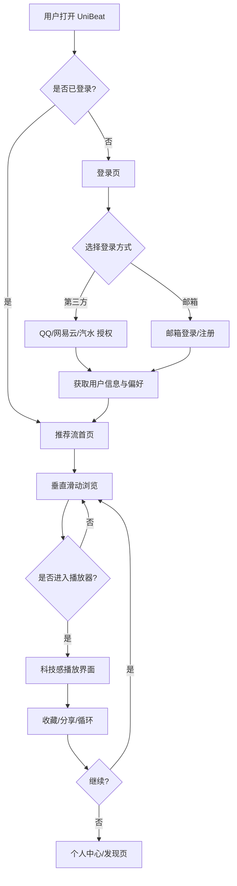

# 多平台音乐聚合在线平台 - 产品需求文档（PRD）

## 1. 产品概述

UniBeat 是一款聚合 QQ 音乐、网易云音乐、汽水音乐三大主流平台的在线音乐应用，采用类汽水音乐的沉浸式短视频流推荐风格，并通过科技感播放界面为用户打造未来感听觉体验。
- **目标用户**：18-35 岁的年轻音乐爱好者，习惯多平台切换、追求个性化推荐与视觉冲击的 Z 世代用户
- **市场价值**：解决用户在多个音乐 App 间反复切换的痛点，统一账号、歌单、推荐流，并通过沉浸式 UI 提升日活与停留时长

## 2. 核心功能

### 2.1 用户角色

| 角色 | 注册方式 | 核心权限 |
|------|---------|---------|
| 游客 | 无需注册 | 浏览推荐流、试听片段 |
| 注册用户 | 邮箱/手机号注册 | 第三方账号绑定、收藏、创建歌单、个性化推荐 |
| VIP 用户 | 注册后开通 | 高品质音质、跳过限制、独家内容标识 |

### 2.2 功能模块

1. **登录页**：多平台账号登录入口、邮箱注册、品牌视觉首屏
2. **推荐流页（首页）**：类汽水音乐垂直滑动卡片流、平台来源切换、即时播放
3. **播放器页**：科技感全屏播放界面、可视化频谱、歌词同步、平台切换
4. **个人中心页**：用户信息、第三方账号绑定状态、我的歌单、最近播放、成就
5. **发现页**：分类歌单广场、榜单、电台、个性化推荐专题

### 2.3 页面详情

| 页面名称 | 模块名称 | 功能描述 |
|---------|---------|---------|
| 登录页 | 品牌首屏 | 动态粒子背景、Logo 渐显、品牌标语 |
| 登录页 | 登录卡片 | QQ/网易云/汽水 第三方登录按钮、邮箱密码登录、注册切换 |
| 推荐流页 | 视频卡片流 | 全屏沉浸式卡片，垂直滑动切换，每张卡片包含封面、歌名、歌手、平台标识 |
| 推荐流页 | 互动栏 | 点赞、评论、收藏、分享、下一首按钮，浮动动效 |
| 推荐流页 | 平台筛选器 | 顶部 Tab 切换"全部/QQ/网易云/汽水"，影响推荐流来源 |
| 播放器页 | 科技感背景 | 动态渐变光晕、网格扫描线、粒子流动 |
| 播放器页 | 频谱可视化 | 实时音频频谱柱状图、环形进度条、3D 旋转唱片 |
| 播放器页 | 歌词区 | 逐句高亮滚动歌词、模糊背景、点击跳转 |
| 播放器页 | 控制台 | 播放/暂停、上一首/下一首、进度条、音质切换、循环模式 |
| 个人中心页 | 用户头部 | 头像、昵称、VIP 标识、第三方账号绑定徽章 |
| 个人中心页 | 数据统计 | 听歌时长、听歌数量、最喜爱曲风雷达图 |
| 个人中心页 | 歌单列表 | 我创建的歌单、收藏歌单、最近播放历史 |
| 发现页 | 分类导航 | 横向滚动的曲风分类标签（流行/电子/嘻哈/国风等） |
| 发现页 | 歌单广场 | 网格卡片展示精选歌单，多平台混合 |
| 发现页 | 榜单区 | 实时排行榜、新歌速递、MV 推荐 |

## 3. 核心流程

**用户使用主流程**：用户打开应用 → 登录/注册（可绑定第三方账号）→ 进入沉浸式推荐流 → 垂直滑动浏览音乐 → 点击进入科技感播放界面 → 收藏/分享 → 返回发现更多内容

**第三方账号绑定流程**：用户在个人中心选择平台 → 模拟跳转授权页 → 返回并获取用户歌单与偏好 → 同步到本地账号

## 4. 用户界面设计

### 4.1 设计风格

- **主色调**：深邃太空黑 `#0A0E1A` + 霓虹电光蓝 `#00F0FF` + 紫红渐变 `#FF2E9F → #7B2FF7`，营造赛博朋克科技感
- **辅助色**：平台标识色（QQ 绿 `#31C27C`、网易云红 `#C20C0C`、汽水橙 `#FF6B35`）
- **按钮风格**：玻璃拟态（glassmorphism）+ 霓虹描边发光，圆角 16px，悬浮微动效
- **字体**：标题使用 `Orbitron`（科技感未来字体），正文使用 `HarmonyOS Sans SC`（中文优雅无衬线）
- **布局风格**：全屏沉浸式卡片流 + 顶部毛玻璃导航栏 + 底部固定 Tab Bar
- **图标风格**：线性霓虹图标，1.5px 描边，悬浮发光，搭配 emoji 点缀

### 4.2 页面设计概览

| 页面名称 | 模块名称 | UI 元素 |
|---------|---------|---------|
| 登录页 | 品牌首屏 | 黑色背景 + 粒子流动 canvas、Logo 渐显动画、品牌标语霓虹发光 |
| 登录页 | 登录卡片 | 玻璃拟态卡片、三个平台渐变按钮、输入框带霓虹聚焦边框 |
| 推荐流页 | 视频卡片流 | 全屏封面图、底部渐变遮罩、歌名大字号粗体、平台徽章右上角 |
| 推荐流页 | 互动栏 | 右侧垂直浮动按钮组，点赞红心爆炸动效，数字气泡 |
| 推荐流页 | 平台筛选器 | 顶部毛玻璃 Tab，选中态霓虹下划线滑动 |
| 播放器页 | 科技感背景 | 多层径向渐变光晕旋转、网格扫描线、漂浮粒子 |
| 播放器页 | 频谱可视化 | 底部 64 条频谱柱状条动态跳动、环形 SVG 进度条 |
| 播放器页 | 3D 唱片 | CSS 3D 旋转唱片、悬浮投影、暂停时停止旋转 |
| 播放器页 | 歌词区 | 中间区域逐句高亮，模糊背景，过渡平滑 |
| 个人中心页 | 用户头部 | 圆形头像带霓虹环、第三方账号徽章横向排列 |
| 个人中心页 | 数据统计 | 雷达图卡片、听歌时长数字滚动动效 |
| 发现页 | 歌单广场 | 网格瀑布流卡片，悬浮上浮+发光描边 |

### 4.3 响应式

- **桌面优先**：1440px 设计基准，沉浸式全屏体验
- **平板适配**：768-1024px，卡片流保持，发现页网格调整为 2 列
- **移动端适配**：≤ 768px，单列卡片流，底部 Tab Bar 优化触摸区域，播放器页全屏沉浸
- **触控优化**：支持垂直滑动手势切换推荐卡片，长按卡片快速预览

### 4.4 动效与交互

- **页面切换**：View Transitions API + 淡入淡出 + 微缩放
- **卡片滑动**：Framer Motion 垂直 snap 滑动，弹性回弹
- **播放器进入**：从底部上滑展开，背景模糊渐显
- **频谱可视化**：Web Audio API 实时分析 + Canvas 渲染
- **悬浮微动效**：按钮 hover 时霓虹光晕扩散，icon 轻微旋转

## 5. 技术约束说明

- 第三方音乐平台 API（QQ/网易云/汽水）需 OAuth 授权，本项目采用 **Mock 数据 + 模拟授权流程** 演示完整体验
- 音频播放采用浏览器原生 `<audio>` + Web Audio API 实现可视化
- 所有平台标识、Logo 仅用于功能演示，不涉及真实数据拉取
