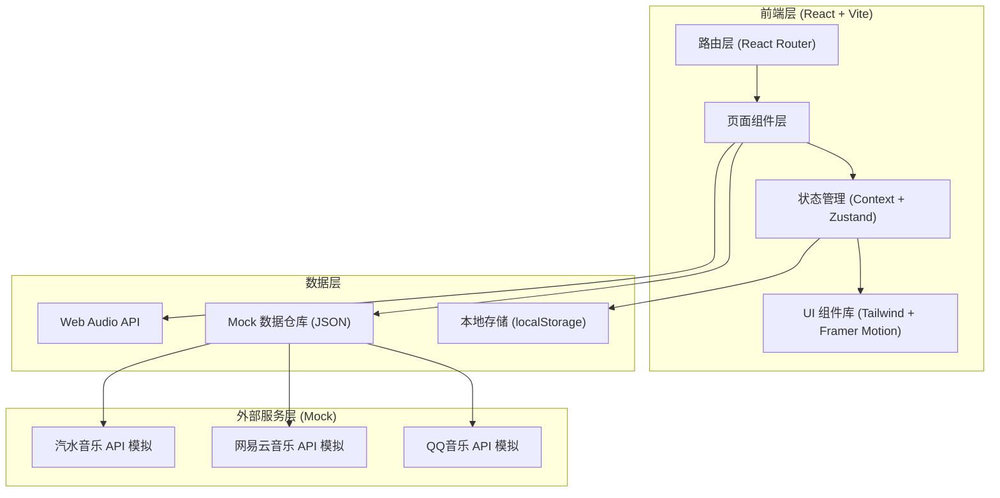
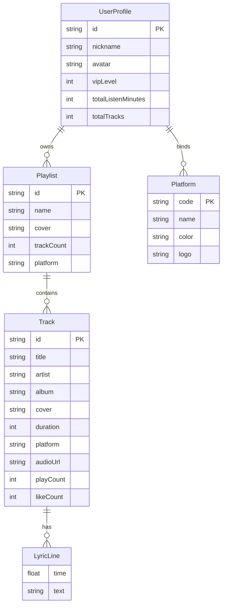

# 多平台音乐聚合在线平台 - 技术架构文档

## 1. 架构设计



## 2. 技术说明

- **前端框架**：React@18 + Vite@5
- **样式方案**：Tailwind CSS@3 + 自定义霓虹主题变量
- **动效库**：Framer Motion@11（页面过渡、卡片滑动、微交互）
- **路由**：React Router@6
- **状态管理**：Zustand@4（轻量全局状态）+ Context（用户登录态）
- **音频处理**：Web Audio API（频谱可视化）+ 原生 Audio 元素
- **图标**：lucide-react
- **可视化图表**：纯 SVG + Canvas（雷达图、频谱图）
- **数据来源**：本地 Mock JSON 数据，模拟三大平台响应
- **后端**：无（纯前端原型，所有"第三方 API"均为 Mock 服务）

## 3. 路由定义

| 路由 | 用途 |
|------|------|
| `/login` | 登录注册页 |
| `/` | 推荐流首页（沉浸式卡片流） |
| `/player/:trackId` | 科技感全屏播放器 |
| `/discover` | 发现页（歌单广场、榜单） |
| `/profile` | 个人中心（用户信息、歌单、统计） |

## 4. API 定义（Mock）

所有 API 通过 `src/services/mockApi.ts` 模拟，返回 Promise，包含 200-500ms 延迟以模拟真实网络。

```typescript
// 平台类型
type Platform = 'qq' | 'netease' | 'qishui';

// 歌曲数据结构
interface Track {
  id: string;
  title: string;
  artist: string;
  album: string;
  cover: string;          // 封面图 URL
  duration: number;       // 秒
  platform: Platform;
  audioUrl: string;       // 音频地址（使用示例音频）
  lyrics: LyricLine[];
  tags: string[];
  playCount: number;
  likeCount: number;
}

interface LyricLine {
  time: number;   // 秒
  text: string;
}

// 用户数据结构
interface UserProfile {
  id: string;
  nickname: string;
  avatar: string;
  vipLevel: 0 | 1 | 2;
  boundPlatforms: Platform[];
  totalListenMinutes: number;
  totalTracks: number;
  favoriteGenres: { genre: string; score: number }[];
  playlists: Playlist[];
  recentPlayed: Track[];
}

interface Playlist {
  id: string;
  name: string;
  cover: string;
  trackCount: number;
  platform: Platform | 'mixed';
}

// Mock API 列表
interface MockApi {
  loginWithPlatform(platform: Platform): Promise<UserProfile>;
  loginWithEmail(email: string, password: string): Promise<UserProfile>;
  getRecommendFeed(platform?: Platform): Promise<Track[]>;
  getTrackById(id: string): Promise<Track>;
  getDiscoverPlaylists(): Promise<Playlist[]>;
  getCharts(): Promise<{ name: string; tracks: Track[] }[]>;
  toggleLike(trackId: string): Promise<boolean>;
  getUserProfile(): Promise<UserProfile>;
}
```

## 5. 服务端架构

本项目为纯前端原型，无后端服务。所有"第三方 API"调用通过 `src/services/mockApi.ts` 中的 Mock 函数实现，返回预设的 JSON 数据。

## 6. 数据模型

### 6.1 数据模型定义



### 6.2 数据定义语言（Mock JSON 结构）

数据存储在 `src/data/` 目录下：

- `tracks.json`：歌曲库（每平台 15+ 首）
- `playlists.json`：歌单库
- `users.json`：模拟用户数据
- `platforms.json`：平台元信息

平台元信息示例：

```json
[
  { "code": "qq", "name": "QQ音乐", "color": "#31C27C", "logo": "Q" },
  { "code": "netease", "name": "网易云音乐", "color": "#C20C0C", "logo": "网" },
  { "code": "qishui", "name": "汽水音乐", "color": "#FF6B35", "logo": "汽" }
]
```

## 7. 项目目录结构

```
src/
├── components/           # 通用组件
│   ├── Layout/           # 布局（TopBar, TabBar）
│   ├── PlatformBadge/    # 平台标识徽章
│   ├── Visualizer/       # 频谱可视化
│   ├── TrackCard/        # 推荐流卡片
│   └── ui/               # 基础 UI（Button, Card, Modal）
├── pages/                # 页面
│   ├── Login/
│   ├── Recommend/        # 推荐流
│   ├── Player/           # 播放器
│   ├── Discover/         # 发现页
│   └── Profile/          # 个人中心
├── services/             # Mock API 服务
│   └── mockApi.ts
├── data/                 # Mock JSON 数据
├── store/                # Zustand 状态
│   ├── userStore.ts
│   └── playerStore.ts
├── hooks/                # 自定义 hooks
├── styles/               # 全局样式与主题
└── App.tsx
```

## 8. 关键技术实现要点

### 8.1 沉浸式卡片流（类汽水音乐）

- 使用 Framer Motion 的 `motion.div` + `drag="y"` 实现垂直拖拽
- 配合 CSS `scroll-snap-type: y mandatory` 实现吸附效果
- 每张卡片全屏占满，滑动时上层卡片缩放下移，下层卡片淡入

### 8.2 科技感播放器

- **动态背景**：多层径向渐变 + CSS keyframes 旋转 + SVG 网格扫描线
- **频谱可视化**：Web Audio API `AnalyserNode.getByteFrequencyData()` + Canvas 64 条柱状渲染
- **3D 唱片**：CSS `transform-style: preserve-3d` + `rotateY` 持续动画
- **环形进度条**：SVG `stroke-dasharray` 动态更新

### 8.3 多平台账号绑定

- 登录页提供三个平台按钮，点击后调用 `loginWithPlatform`
- 个人中心展示绑定状态徽章，支持"绑定/解绑"切换
- Mock 流程：模拟跳转 → 1.5s 延迟 → 返回用户数据

### 8.4 个性化推荐

- 基于用户 `favoriteGenres` 雷达图数据，从 Mock 曲库中按标签匹配排序
- 推荐流首次加载混合三平台，切换 Tab 后过滤单平台
- 收藏/点赞行为写入 localStorage，影响后续推荐权重
